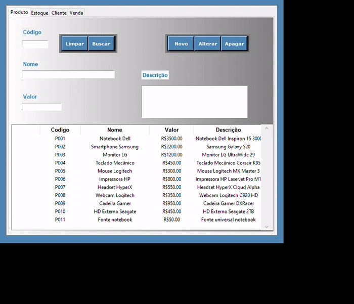

# MyStock

Sistema de gerenciamento de estoque, produtos, clientes e vendas, desenvolvido em Python com interface gráfica utilizando Tkinter.



## Funcionalidades

- **Cadastro de Produtos:** Permite adicionar, editar, buscar e remover produtos, com campos para código, nome, valor e descrição.
- **Controle de Estoque:** Gerencia a quantidade de produtos em estoque, com alertas para estoque mínimo e máximo.
- **Cadastro de Clientes:** Permite adicionar, editar, buscar e remover clientes, com campos para CPF, nome, telefone e endereço.
- **Registro de Vendas:** Realiza vendas, atualiza o estoque automaticamente e registra informações como produto, cliente, quantidade, data e valor.
- **Interface Gráfica:** Navegação por abas para acesso rápido às funcionalidades de Produto, Estoque, Cliente e Venda.

## Estrutura do Projeto

```
business/
    cliente.py
    estoque.py
    produto.py
    venda.py
database/
    base.py
    ibase.py
    myStockDb.py
ui/
    home.py
    tela.py
    telaCliente.py
    telaEstoque.py
    telaProduto.py
    telaVenda.py
MyStockDb.sqlite
README.md
```

## Como Executar

1. Certifique-se de ter Python 3 instalado.
2. Execute o script principal da interface gráfica:
   ```sh
   python ui/home.py
   ```
3. O banco de dados será criado automaticamente na primeira execução.

## Principais Arquivos

- [`ui/home.py`](ui/home.py): Tela principal com navegação por abas.
- [`ui/telaProduto.py`](ui/telaProduto.py): Tela de cadastro e gerenciamento de produtos.
- [`ui/telaEstoque.py`](ui/telaEstoque.py): Tela de controle de estoque.
- [`ui/telaCliente.py`](ui/telaCliente.py): Tela de cadastro de clientes.
- [`ui/telaVenda.py`](ui/telaVenda.py): Tela de registro de vendas.
- [`business/produto.py`](business/produto.py), [`business/estoque.py`](business/estoque.py), [`business/cliente.py`](business/cliente.py), [`business/venda.py`](business/venda.py): Lógica de negócio das entidades.
- [`database/base.py`](database/base.py): Implementação genérica de operações CRUD.
- [`database/myStockDb.py`](database/myStockDb.py): Criação e popularização do banco de dados SQLite.

## Observações

- O sistema utiliza SQLite como banco de dados local.
- O código segue o padrão de separação entre interface, lógica de negócio e acesso a dados.
- Para rodar os testes unitários, recomenda-se criar scripts de teste utilizando `pytest` ou `unittest`.

## Autor

Desenvolvido por Thiago de Lima Chagas.